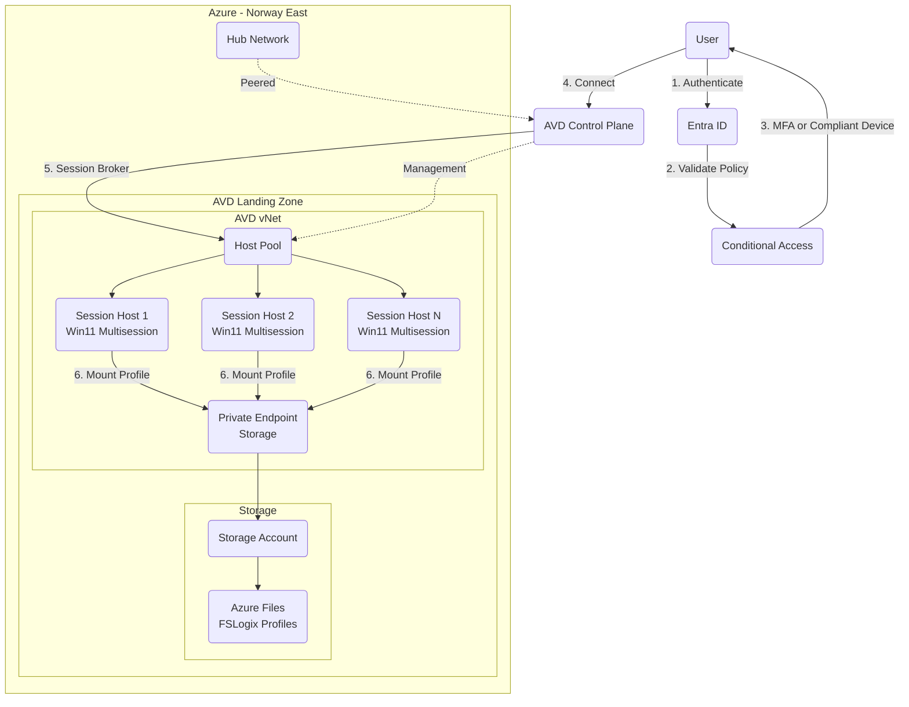

# Azure Virtual Desktop - Multisession Design

## Scope

This design document describes how Azure Virtual Desktop (AVD) will be set up for Contoso using Windows 11 multisession session hosts.
It covers the infrastructure components including session hosts, FSLogix profile management, storage configuration with Azure Files, networking with Private Endpoints, and security controls through Conditional Access.
The design focuses on the infrastructure and security architecture for AVD deployment in Norway East region.
This document does not cover detailed user assignment policies, application packaging and delivery, or the day-to-day operational procedures for managing AVD environments.

## Rationale

Azure Virtual Desktop provides a modern desktop virtualization platform that enables secure remote access to corporate resources.
By using Windows 11 multisession, we can optimize costs by allowing multiple users to share the same virtual machine while maintaining individual user experiences.
FSLogix is essential for providing a seamless user profile experience across sessions, ensuring users have consistent settings and data regardless of which session host they connect to.
Azure Files provides enterprise-grade storage with built-in redundancy and security features that integrate naturally with AVD and FSLogix.
Private Endpoints ensure that all traffic between AVD components and storage remains within the Microsoft backbone network, eliminating exposure to the public internet.
Deploying session hosts in Norway East aligns with Contoso's existing Azure infrastructure and data residency requirements as our hub is already located in this region.
Conditional Access with MFA and device compliance requirements ensures that only authorized users on trusted devices can access the virtual desktop environment, providing defense-in-depth security.

## Alternatives Considered

| Alternative | Description | Pros | Cons | Why Not Chosen |
|-|-|-|-|-|
| **AVD with Windows 11 Multisession + FSLogix + Azure Files + Private Endpoints (Selected)** | Deploy AVD using Windows 11 multisession session hosts with FSLogix profiles stored on Azure Files, secured with Private Endpoints | Cost-effective through session sharing; Enterprise-grade profile management; Secure private networking; Native Azure integration; Managed storage service | Requires careful capacity planning; Dependent on Azure availability; More complex networking setup | N/A - This is the selected approach |
| **AVD with Windows 10/11 Single Session** | Deploy AVD using single-session (VDI) session hosts instead of multisession | Simpler troubleshooting; Full isolation between users; Familiar VDI experience | Significantly higher costs due to one VM per user; Increased management overhead; Less efficient resource utilization | Not cost-effective for scenarios where multiple users can share resources; Does not leverage the cost benefits of multisession |
| **Azure Files Premium** | Use Azure Files Premium tier instead of Standard | Better performance with lower latency; Guaranteed IOPS; More predictable performance | Significantly higher cost; May be overkill for standard office workloads; Minimum capacity requirements | Standard tier Azure Files provides adequate performance for FSLogix profiles in most scenarios; Premium adds unnecessary cost without proportional benefit |
| **Azure NetApp Files** | Use Azure NetApp Files instead of Azure Files for profile storage | Superior performance; Advanced snapshot capabilities; Better suited for very high IOPS requirements | Much higher cost; Additional complexity in management; Overkill for typical AVD deployments | Adds significant cost and complexity without clear benefit for standard AVD workloads; Azure Files is sufficient for FSLogix profile requirements |
| **Traditional VPN + On-premises Virtual Desktop** | Deploy virtual desktop infrastructure on-premises | Full control over infrastructure; No dependency on cloud; Existing skillset | High capital expenditure; Limited scalability; No geographic redundancy; Requires VPN for remote access; Higher management overhead | Does not leverage cloud benefits; Limited business continuity capabilities; Higher total cost of ownership |
| **Windows 365 Cloud PC** | Use Windows 365 instead of AVD | Simpler management; Predictable per-user pricing; Less infrastructure to manage | Higher per-user cost; Less flexibility in configuration; Cannot leverage multisession cost savings; Limited integration with existing Azure infrastructure | Does not provide the cost optimization of multisession; Less control over infrastructure; Not as well integrated with enterprise Azure environments |

## Conceptual Design

Azure Virtual Desktop will be deployed in its own dedicated landing zone within the Contoso Azure environment.
Session hosts running Windows 11 multisession will be deployed in Norway East and connected to the landing zone virtual network.
User profiles will be managed by FSLogix and stored on an Azure Files share within a storage account.
The storage account will be secured using Private Endpoints to ensure all traffic remains on the Azure backbone network.
Access to AVD will be controlled through Conditional Access policies requiring either MFA or compliant device status.
The AVD infrastructure will integrate with the existing hub in Norway East for connectivity to other Azure resources and on-premises systems.

The conceptual design shows the main components and their relationships:

## Logical Design

### Architecture Components

**Session Hosts**

Session hosts are Azure virtual machines running Windows 11 Enterprise multisession.
These VMs are domain-joined (either to on-premises AD or Entra ID) to enable user authentication and group policy management.
Session hosts are organized into host pools, which are logical groupings that share the same configuration.
The multisession capability allows multiple users to connect simultaneously to a single VM, optimizing cost and resource utilization.

**FSLogix Profile Management**

FSLogix provides profile container technology that stores user profiles in VHD(X) files on a network share.
When a user logs in, their profile container is mounted to the session host, providing a native Windows profile experience.
This ensures profile consistency across different session hosts and reduces logon times.
FSLogix also supports Office 365 container technology for optimizing Microsoft 365 app performance.

**Azure Files Storage**

Azure Files provides SMB file shares that are natively accessible from Windows VMs.
The storage account will be configured with appropriate redundancy (LRS or ZRS based on requirements).
Azure Files supports Active Directory authentication, enabling seamless access control using Windows ACLs.
The file share will be sized appropriately based on the number of users and expected profile sizes.

**Private Endpoints**

Private Endpoints provide private IP addresses from the virtual network for the storage account.
This ensures that all traffic between session hosts and the storage account traverses the Azure backbone network.
Public access to the storage account will be disabled, eliminating internet-based attack vectors.
DNS configuration will be updated to resolve the storage account FQDN to the private IP address.

**Networking**

The AVD landing zone virtual network will be peered with the hub network in Norway East.
Network Security Groups (NSGs) will control traffic flow between subnets.
Azure Firewall in the hub can provide additional traffic inspection and control if required.
User Device Redirect (UDR) can route traffic through the hub for centralized security policy enforcement.

### Security Controls

**Conditional Access**

Conditional Access policies will enforce security requirements before granting access to AVD.
Policies will require:

- Multi-factor authentication (MFA) OR
- Compliant device status (managed by Intune or other MDM solution)

These policies ensure that only authenticated users on trusted devices can access corporate resources.
Additional controls can include location-based restrictions, risk-based policies, or session controls.

**Identity and Access Management**

Users authenticate to Entra ID (Azure AD) to access AVD.
Role-Based Access Control (RBAC) determines which users can access which host pools and applications.
Session hosts can be domain-joined to extend on-premises AD security policies or use Entra ID join for cloud-native identity.

**Network Security**

Private Endpoints eliminate public internet exposure for storage access.
Network Security Groups restrict traffic flows between AVD components.
All management traffic uses encrypted channels (HTTPS, RDP over TLS).
Integration with hub network enables centralized security monitoring and control.

**Data Protection**

FSLogix profile containers are stored on Azure Files with encryption at rest enabled by default.
Encryption in transit is enforced using SMB 3.0 with encryption.
Azure Backup can be configured for profile data protection and recovery.
Storage account access keys should be rotated regularly and managed securely.

### Deployment Considerations

**Capacity Planning**

Session host sizing should account for the number of concurrent users and workload requirements.
Windows 11 multisession typically supports 6-10 users per VM depending on use case.
Azure Files capacity should be planned based on average profile size multiplied by number of users plus growth margin.
Host pool auto-scaling can dynamically adjust the number of running session hosts based on demand.

**High Availability**

Deploy session hosts across Availability Zones (where available) for zone-level redundancy.
Azure Files provides built-in redundancy (LRS, ZRS, or GRS) for profile storage.
Host pools can span multiple session hosts to provide workload distribution and fault tolerance.
The AVD control plane is a managed service with built-in high availability.

**Monitoring and Management**

Azure Monitor and Log Analytics provide insights into AVD performance and user experience.
Diagnostic settings should be enabled for session hosts, storage accounts, and network components.
Alerts should be configured for critical metrics such as session host health, storage capacity, and connection failures.
Azure Virtual Desktop Insights provides a unified dashboard for monitoring AVD environments.

### Traffic Flows

1. **User Authentication**: User initiates connection → Entra ID authentication → Conditional Access evaluation → Token issued
2. **Session Connection**: User connects to AVD → Control plane brokers session → User assigned to session host → RDP session established
3. **Profile Mount**: User logs on to session host → FSLogix agent requests profile → Private Endpoint resolves storage → Profile container mounted
4. **Resource Access**: User accesses applications → Traffic flows through session host → Hub network provides connectivity to other resources

### Assumptions and Constraints

- Users have appropriate licenses for Windows 11 Enterprise multisession and AVD
- Network connectivity exists between the AVD landing zone and hub network in Norway East
- DNS resolution is configured correctly for Private Endpoints
- Session hosts can be domain-joined or Entra ID joined based on identity strategy
- Sufficient Azure quotas exist for VM deployment in Norway East region
- Storage account performance tier (Standard or Premium) selected based on performance requirements and budget

This design provides a secure, scalable, and cost-effective Azure Virtual Desktop solution that meets Contoso's requirements for multisession desktops with modern security controls.
