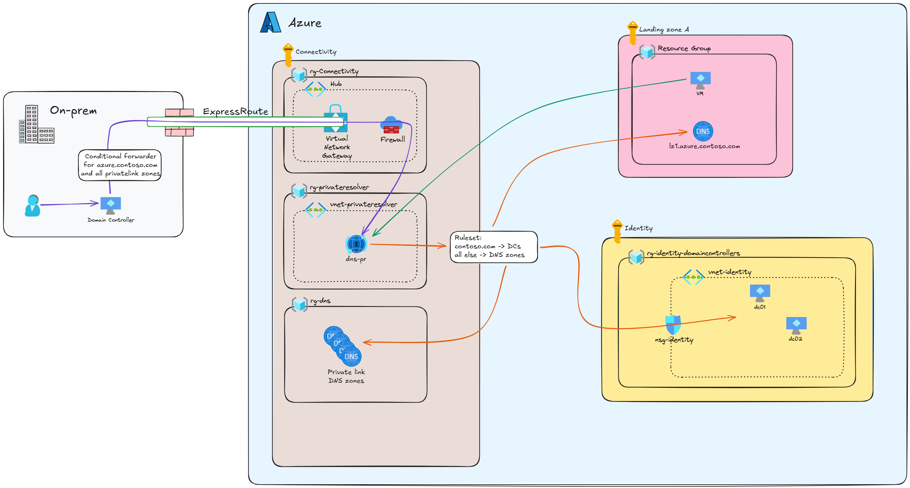

# DNS Setup, Azure

## Scope

This document describes the design of the DNS setup for our architecture.
It covers the integration between on-prem domain controllers, Azure Private Resolver, Azure Private DNS Zones and domain controllers in Azure.
It does not cover other DNS configurations unrelated to Azure or the on-prem environment.
It also does not cover public DNS.

## Rationale

The design aims to ensure seamless DNS resolution between the on-prem environment and Azure.
By using a Private Resolver in Azure, we can efficiently forward DNS queries to the appropriate domain controllers or resolve them directly, depending on the ruleset.
This setup minimizes latency and ensures high availability.

## Alternatives Considered

| Alternative | Description | Pros | Cons | Why Not Chosen |
|-|-|-|-|-|
| **Azure Private Resolver + Domain Controllers (Selected)** | Use Azure Private Resolver with forwarding rules to domain controllers and Azure DNS as needed | Flexible DNS resolution; Handles both corporate domains and Azure-specific zones; Optimized performance with intelligent routing; Supports Private DNS Zones for Azure services | Requires additional Azure service (Private Resolver); More complex configuration | N/A - This is the selected approach |
| **Domain Controllers Only** | Use only domain controllers for all DNS resolution, without Azure Private Resolver | Simpler architecture; Familiar to traditional IT teams; Single DNS service to manage | Domain controllers must handle all DNS traffic including Azure-specific queries; Higher load on domain controllers; No native integration with Azure Private DNS Zones; Requires manual configuration for all Azure services; Less optimal routing for Azure-internal queries | Does not leverage Azure-native DNS capabilities and puts unnecessary load on domain controllers for non-corporate DNS queries |
| **No DNS in Azure** | Rely entirely on on-premises DNS infrastructure with no DNS services deployed in Azure | Minimal Azure footprint; Lower Azure costs for DNS services | Azure resources cannot resolve DNS without connectivity to on-prem; Single point of failure if connection to on-prem is lost; High latency for Azure workloads querying DNS over ExpressRoute/VPN; No support for Azure Private DNS Zones; Azure services requiring DNS would fail during connectivity issues; Impossible to resolve Azure private endpoints and other Azure-internal resources | Unacceptable for production workloads as it creates a critical dependency on network connectivity and eliminates DNS resolution during any network disruption, making Azure resources unreachable |

## Conceptual Design

```mermaid
---
config:
  layout: elk
  look: handDrawn
  theme: dark
---
flowchart LR
    OnpremDC(On-Prem Domain Controllers)
    PrivateResolver(Azure Private Resolver)
    AzureDC(Azure Domain Controllers)
    AZFW(Azure Firewall DNS Proxy)
    ClientA(Client)
    ClientB(Client)
    AzureDNS(Azure DNS Server)
    PrivateDNSZone(Azure Private DNS Zone)

    subgraph OnPrem [On-Prem Environment]
        OnpremDC
        ClientA
    end

    subgraph Azure [Azure Environment]
        AzureDNS
        PrivateDNSZone

        subgraph Hub [Hub]
            PrivateResolver
            AZFW
        end
        
        subgraph IdentityLandingZone [Identity Landing Zone]
            AzureDC
        end

        subgraph ClientLandingZone [Client Landing Zone]
            ClientB
        end
    end

    ClientA -->|DNS Query| OnpremDC
    OnpremDC -->|Conditional forwarder azure.contoso.com| AZFW
    AZFW --> PrivateResolver

    ClientB -->|DNS Query| AZFW

    PrivateResolver -->|Matches Ruleset| AzureDC
    PrivateResolver -->|Does Not Match Ruleset| AzureDNS

    AzureDNS --> PrivateDNSZone
```

### Traffic flow

#### On-prem client

```mermaid
sequenceDiagram
    participant OnpremClient as On-Prem Client
    participant OnpremDC as On-Prem Domain Controller
    participant AzureFW as Azure Firewall (DNS Proxy)
    participant PrivateResolver as Azure Private Resolver
    participant AzureDC as Azure Domain Controller

    OnpremClient->>OnpremDC: DNS Query
    OnpremDC->>AzureFW: Conditional forwarder azure.contoso.com
    OnpremDC->>AzureFW: Conditional forwarder private endpoint zones
    AzureFW->>PrivateResolver: DNS Query
    PrivateResolver->>AzureDNS: if *.azure.contoso.com
    PrivateResolver->>AzureDC: if *.contoso.com
    PrivateResolver->>AzureDNS: else
```

#### Azure client

```mermaid
sequenceDiagram
    participant AzureClient as Azure Client
    participant AzureFW as Azure Firewall (DNS Proxy)
    participant PrivateResolver as Azure Private Resolver
    participant AzureDC as Azure Domain Controller

    AzureClient->>AzureFW: DNS Query
    AzureFW->>PrivateResolver: DNS Query
    PrivateResolver->>AzureDNS: if *.azure.contoso.com
    PrivateResolver->>AzureDC: if *.contoso.com
    PrivateResolver->>AzureDNS: else
```

## Logical Design

The logical design diagram is saved as a PNG file in this folder and included below:

